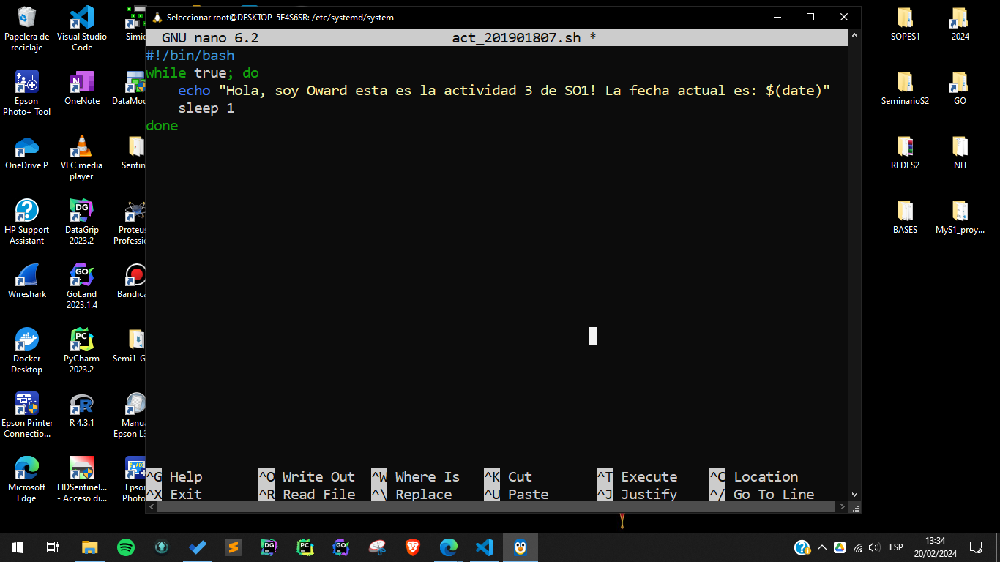
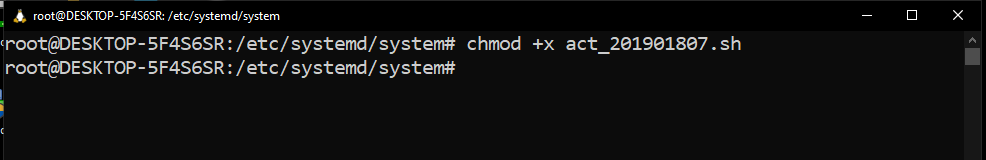
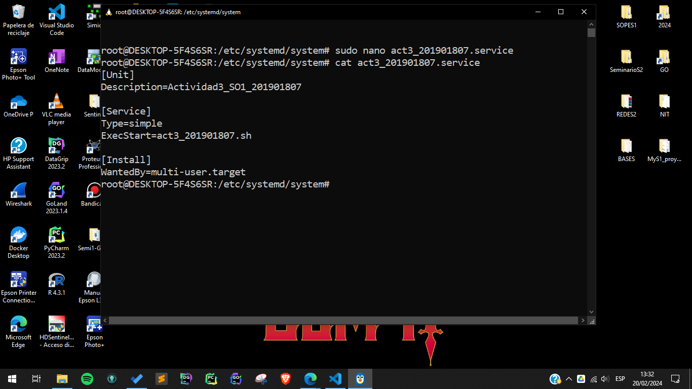
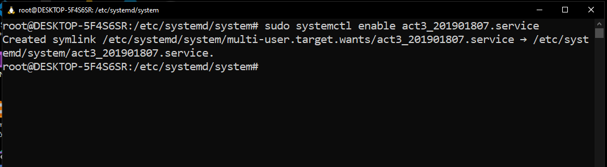
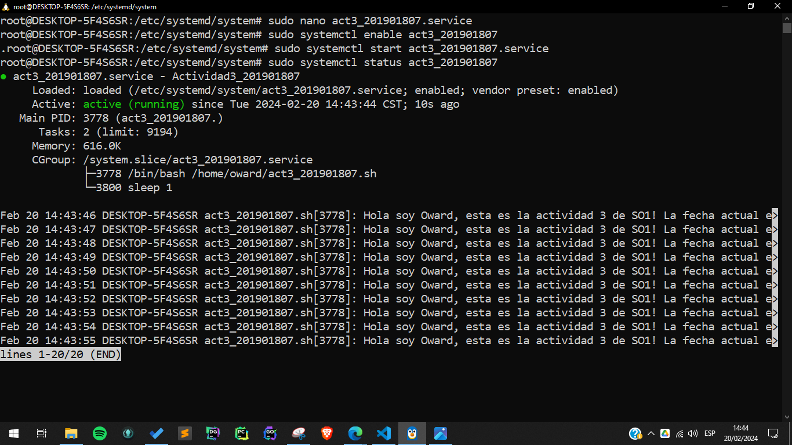
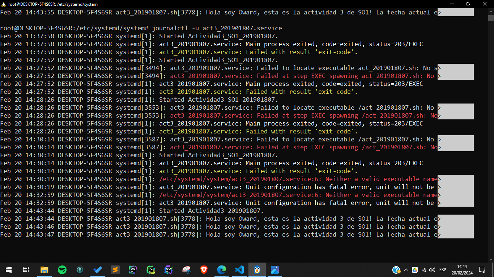
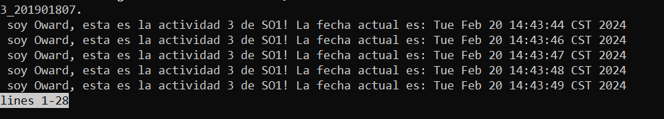
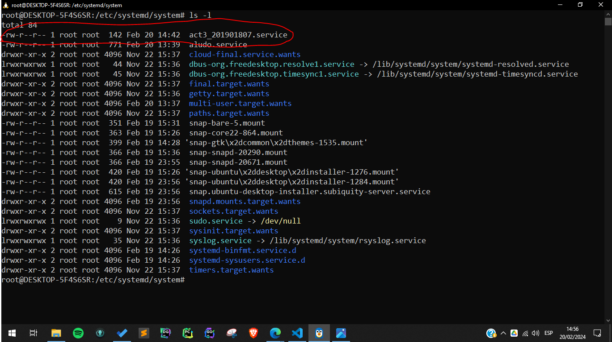

## Creando el sh para poder mostrar un saludo y la fecha actual

## Dando permisos al script

## Creando el service

## Habilitando el servicio para que inicie con el sistema

## Corriendo el servicio

## Ver el journal 
(Errores de pruebas previas)
 ```
journalctl -u act3_201901807.service 
 ```
 
### Ver el log completo

 

### Prueba de que el service está en /etc/systemd/system

 