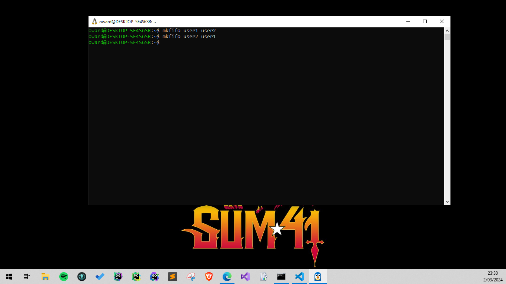
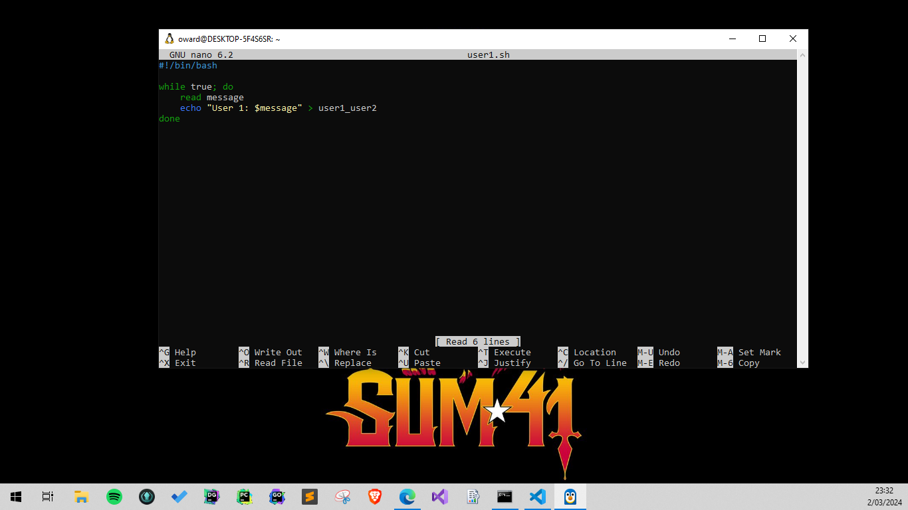
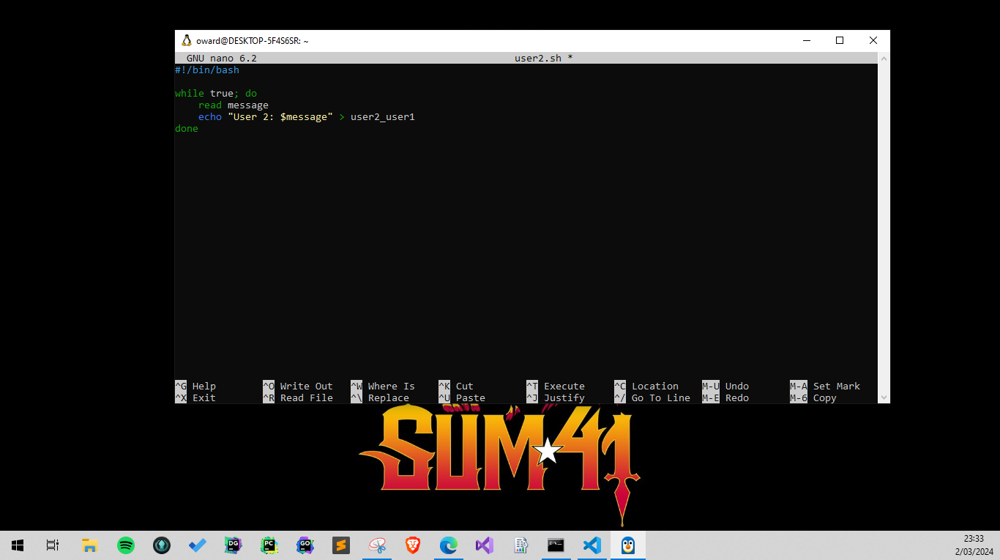
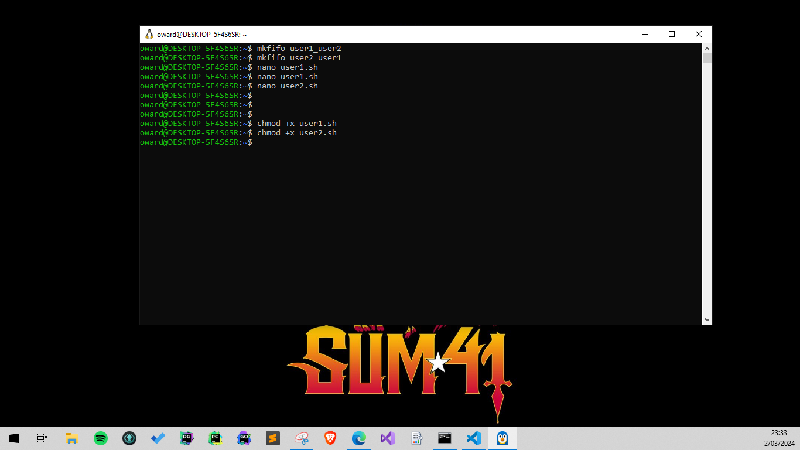
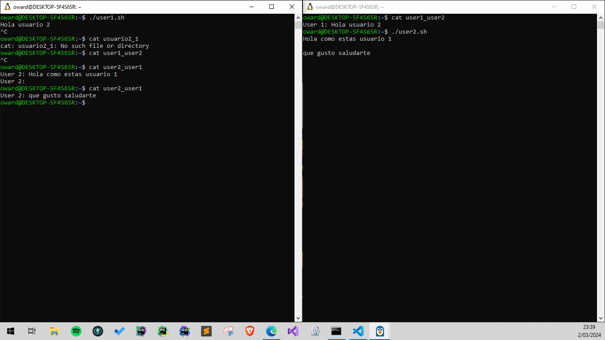

## Creando los pipes con mkfifo, esta estructura de datos nos permitiran comunicarnos entre procesos

## Creando el script del chat para el usuario1

## Creando el script del chat para el usuario2

## Les damos los permisos de ejecución a los script que acabamos de crear

## Realizamos la prueba de chat usando 2 terminales, ejecutando nuestros script
